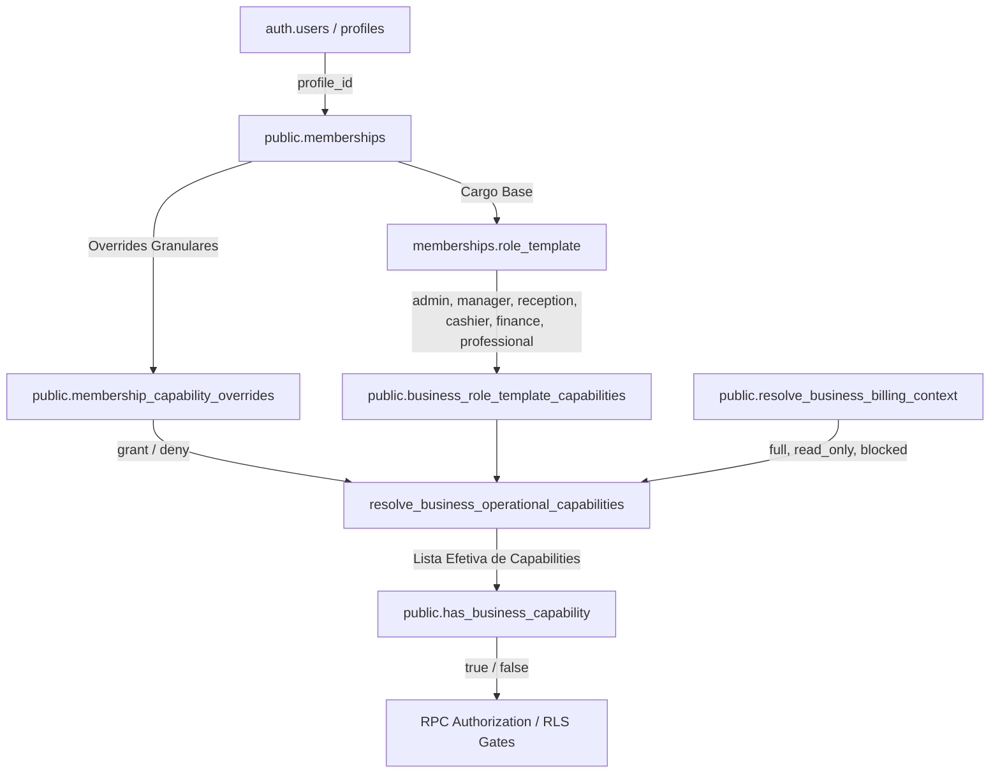

# Autoridade de Capabilities Operacionais (PS1-E1B)

## 1. Visão Geral e Filosofia de Autorização

No modelo arquitetural moderno do CutSync:

> **"Roles describe job function; capabilities grant authority."**
> *(Cargos descrevem a função profissional; capabilities concedem a autoridade operacional.)*

Nenhuma operação do backend deve perguntar `"Este usuário é admin?"` ou `"Este usuário é professional?"` quando a ação possui uma capability correspondente no catálogo de 38 capacidades de negócio da plataforma.

---

## 2. Fluxo Canônico de Resolução



### 2.1 Passos da Avaliação Canônica:
1. **Identidade do Ator:** Extraída de `(SELECT auth.uid())` de forma infalsificável.
2. **Contexto da Unidade:** Validação do `target_establishment_id` e existência de vínculo ativo em `public.memberships` (`status = 'active' AND revoked_at IS NULL`).
3. **Catálogo de Capabilities:** Verificação de existência e ativação no `public.business_capability_catalog`.
4. **Access Mode / Billing:** Avaliação do status do estabelecimento via `resolve_business_billing_context`:
   - `full`: Todas as capabilities permitidas pelo cargo e overrides ficam ativas.
   - `read_only`: Apenas capabilities marcadas com `read_only_allowed = true` (ex: `view_services`, `view_clients`, `view_unit_reports`) permanecem ativas. Capabilities mutáveis retornam `false`.
   - `blocked`: Nenhuma capability operacional é concedida (retorna `false` imediatamente).
5. **Overrides de Membership:** Overrides com `effect = 'deny'` têm precedência e revogam capabilities do template base. Overrides com `effect = 'grant'` aprovados expandem as capabilities do titular.

---

## 3. Primitiva Canônica de Autorização

```sql
public.has_business_capability(
  target_establishment_id uuid,
  required_capability text
)
RETURNS boolean
```

* **Segurança:** `SECURITY DEFINER`, `SET search_path = pg_catalog, public`.
* **Grants:** `REVOKE ALL FROM PUBLIC, anon; GRANT EXECUTE TO authenticated, service_role;`.
* **Fail-Closed:** Retorna `false` sumariamente para IDs nulos, usuários não autenticados, memberships revogadas, capabilities desconhecidas ou contas bloqueadas.

---

## 4. Matriz de Cargos vs Capabilities Canônicas

| Cargo (`role_template`) | Capabilities Operacionais Principais | Capabilities Proibidas (Negadas) |
| :--- | :--- | :--- |
| **`admin`** | `manage_services`, `manage_team`, `manage_admins`, `view_unit_reports`, `manage_operational_settings`, `manage_team_blocks`, `create_team_walk_in`, `view_clients`, `manage_clients` | *(Nenhuma dentro do escopo da unidade)* |
| **`manager`** | `manage_services`, `manage_team`, `view_unit_reports`, `manage_team_blocks`, `create_team_walk_in`, `view_clients`, `manage_clients` | `manage_admins` *(somente admin/owner pode gerenciar administradores)* |
| **`reception`** | `create_team_walk_in`, `manage_clients`, `view_clients`, `view_team_agenda` | `manage_services`, `manage_team`, `manage_admins`, `manage_operational_settings` |
| **`cashier`** | `view_orders`, `manage_own_orders`, `take_payments`, `view_cash` | `manage_services`, `manage_team`, `manage_admins` |
| **`finance`** | `view_financial_reports`, `view_unit_reports`, `view_team_commission`, `view_payments` | `manage_team`, `manage_services`, `manage_operational_settings` |
| **`professional`** | `view_own_agenda`, `manage_own_blocks`, `create_self_walk_in`, `view_services`, `view_own_commission` | `manage_services`, `manage_team`, `manage_admins`, `manage_team_blocks`, `view_unit_reports` |

---

## 5. Exceções e Distinções Arquiteturais

1. **Plataforma / Superadmin:** `public.is_superadmin()` é um predicado de governança e auditoria da plataforma SaaS e não substitui capabilities operacionais de rotina de negócios.
2. **Organizações Multiunidade:** Cargos em `organization_members` (`owner`, `manager`, `finance`) governam visões consolidadas da organização e não injetam automaticamente capabilities locais em unidades não vinculadas.
3. **Billing / Payer Authority:** A autoridade sobre contratos Stripe e assinaturas decorre de `BusinessAccessContext` (`billing_owner`, `payer_role`) e nunca da simples navegação na superfície operacional da unidade.

---

## 6. Service Order Scope Policy (PS1-E1B.2)

A governança do domínio de **Service Orders / Comandas** opera sob segregação estrita de escopo operacional, desacoplada de papéis legados (`owner`, `admin`, `membership.role`, `profiles.role`):

### 6.1 Taxonomia de Capabilities de Comanda

1. **`view_orders` (Leitura Base):**
   - Concede acesso à leitura de comandas.
   - Sem `view_team_orders`, a leitura é **estritamente restrita** a comandas onde `target_professional_id = (SELECT auth.uid())`.
   - `read_only_allowed = true` (permanece ativa em modo read-only por inadimplência).

2. **`view_team_orders` (Escopo Team-Wide):**
   - Concede visibilidade de comandas de todos os profissionais da unidade.
   - Atribuída por padrão aos templates `reception`, `cashier`, `manager` e `admin`.
   - **NÃO** é atribuída a `professional` nem a `finance`.
   - `read_only_allowed = true`.

3. **`manage_own_orders` (Mutação Própria):**
   - Permite criar itens, iniciar, concluir e fechar comandas onde o ator é o profissional responsável.
   - Atribuída a `professional`, `manager` e `admin`.
   - `read_only_allowed = false`.

4. **`manage_team_orders` (Mutação da Equipe):**
   - Permite mutações em comandas de qualquer profissional da equipe (ex: atendimento pela recepção ou caixa).
   - Atribuída a `reception`, `cashier`, `manager` e `admin`.
   - `read_only_allowed = false`.

5. **`void_orders` (Anulação de Comanda):**
   - Permite anular uma comanda aberta com motivo formal (`void_reason`) e versão concorrente.
   - Atribuída a `manager` e `admin` (e `owner` via resolvedor total).
   - `read_only_allowed = false`, `sensitive_override = true`.

6. **`approve_sensitive_actions` (Aprovação / Reabertura Sensível):**
   - Exigida **cumulativamente** para operações de alta criticidade e reversão de estado final.
   - O contrato canônico de `reopen_voided_service_order` exige:
     $$\text{void\_orders} \land \text{manage\_team\_orders} \land \text{approve\_sensitive\_actions}$$
   - Atribuída a `manager` e `admin` (e `owner`). Sujeita a bloqueio imediato se houver override com `effect = 'deny'`.

### 6.2 Níveis de Acesso: Read vs Team Scope vs Mutation vs Sensitive Mutation

| Nível de Acesso | Capabilities Exigidas | Quem Possui por Default |
| :--- | :--- | :--- |
| **Read Próprio** | `view_orders` | `professional`, `reception`, `cashier`, `manager`, `admin`, `owner` |
| **Read Equipe (Team Scope)** | `view_orders` + `view_team_orders` | `reception`, `cashier`, `manager`, `admin`, `owner` |
| **Mutação Própria** | `manage_own_orders` (quando `target_professional = actor`) OU `manage_team_orders` | `professional`, `reception`, `cashier`, `manager`, `admin`, `owner` |
| **Mutação Equipe** | `manage_team_orders` | `reception`, `cashier`, `manager`, `admin`, `owner` |
| **Anulação (Void)** | `void_orders` | `manager`, `admin`, `owner` |
| **Reabertura (Sensitive Mutation)** | `void_orders` + `manage_team_orders` + `approve_sensitive_actions` | `manager`, `admin`, `owner` |

### 6.3 Política Canônica de Finance

O cargo **`finance`** foi concebido para auditoria contábil, conciliação e visão consolidada de faturamento:
- **Possui:** `view_financial_reports`, `view_unit_reports`, `view_payments`, `view_cash`, `view_team_commission`, `view_reconciliation`, `manage_reconciliation`, `view_fiscal`, `view_payment_provider`.
- **NÃO Possui:** `view_team_orders`, `manage_team_orders`, `void_orders`, `approve_sensitive_actions`.
- **Comportamento:** O usuário Finance não visualiza notas internas (`internalNotes`), metadados de eventos operacionais ou comandas individuais da equipe. Ele acessa agregações financeiras e relatórios analíticos, mantendo a segregação de deveres (SoD) recomendada para o motor financeiro **PS8 — Financial Operations**.

