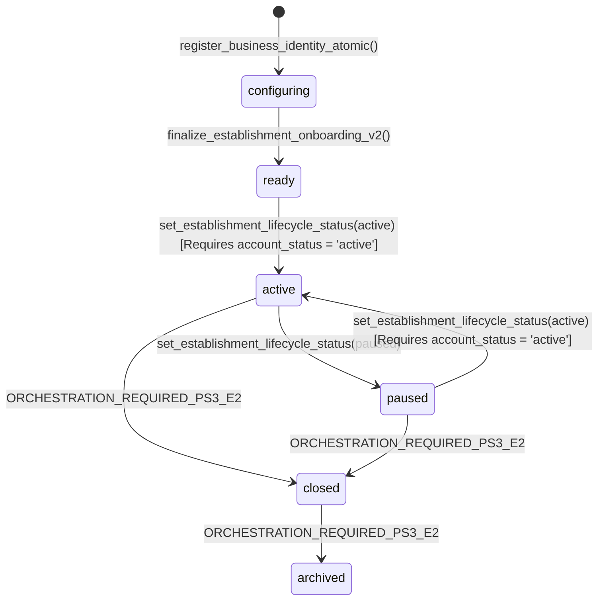

# Establishment Lifecycle Architecture & Authority Cutover (PS3-E1)

## 1. Executive Summary

This document defines the canonical domain boundaries, authority matrix, state transitions, and integration invariants for CutSync establishments following the **PS3-E1** cutover.

Prior to PS3-E1, finishing the establishment onboarding wizard directly mutated `establishments.account_status = 'active'`, blending operational readiness with governance verification and platform risk management.

PS3-E1 completely decouples these concerns into 5 distinct orthogonal lifecycle models:

```text
Business Registration
        ↓
Organization + Unit Created
        ↓
lifecycle_status = 'configuring'
account_status   = 'pending_verification'
        ↓
Operational Setup (Opening hours, services, team)
        ↓
finalize_establishment_onboarding_v2()
        ↓
lifecycle_status = 'ready'
account_status   = 'pending_verification' (UNTOUCHED)
        ↓
Independent Governance Review
        ↓
account_status = 'active'
        ↓
Explicit Operational Activation (set_establishment_lifecycle_status)
        ↓
lifecycle_status = 'active'
```

---

## 2. Orthogonal Domain Dimensions

CutSync establishes strict boundaries between five operational and platform statuses:

| Dimension | Attribute / Function | Allowed / Resolved Values | Authority / Responsible Domain |
| :--- | :--- | :--- | :--- |
| **Operational Lifecycle** | `establishments.lifecycle_status` | `draft`, `configuring`, `ready`, `active`, `paused`, `closed`, `archived` | Operational Establishment Admin / Capability `manage_operational_settings` (AAL2) |
| **Platform Governance** | `establishments.account_status` | `pending_verification`, `active`, `delinquent`, `blocked` | Platform Governance Authority (backend-authorized governance roles, e.g. SaaS_Editor / SaaS_Owner / Superadmin). Business capabilities **NEVER** grant `account_status` mutation. |
| **Financial Entitlement** | `public.billing_access_mode(establishment_id)` *(Derived Function)* | `full`, `read_only`, `blocked` | SaaS Subscription Entitlement Engine. Inputs: active subscription, trial, transition, courtesy, grace period. **Billing lifecycle ≠ establishment lifecycle**. |
| **Identity Verification** | `establishments.kyc_status` | `unsubmitted`, `pending`, `approved`, `rejected` | SaaS Compliance / KYC Document Verification Review |
| **Marketplace Discovery** | `establishments.discovery_status` | `draft`, `published` | Editorial Intent (`publish_establishment_discovery`, `unpublish_establishment_discovery`). Editorial publication intent is preserved across operational pauses; effective public visibility dynamically requires `discovery_status = 'published'`, `account_status = 'active'`, and `lifecycle_status = 'active'`. |

---

## 3. Operational Lifecycle State Machine



### Transition Invariants:

1. **`configuring` $\rightarrow$ `ready`**:
   - Authorized by `manage_operational_settings` capability + AAL2.
   - Enforces `establishment_configuration_is_ready(establishment_id)`:
     - Opening hours configured and parsable.
     - At least 1 active service.
     - At least 1 active administrative or operational management membership.
   - Saves opening hours.
   - Increments `lifecycle_version`.
   - Records `establishment_lifecycle_events` and audit log.
   - **NEVER** mutates `account_status`.

2. **`ready` $\rightarrow$ `active`**:
   - Requires `account_status = 'active'` (Platform governance approval).
   - Requires `establishment_configuration_is_ready(...) = true`.
   - Requires `manage_operational_settings` capability + AAL2.
   - Fails with `governance_not_active` if platform governance has not approved the unit.

3. **`active` $\leftrightarrow$ `paused`**:
   - Purely operational state change for maintenance, holidays, or temporary pauses.
   - Does **NOT** mutate `account_status`.
   - Does **NOT** cancel subscriptions or revoke billing access.
   - Does **NOT** revoke establishment memberships or organization links.
   - Staff members retain authenticated business access to configure settings.
   - Public marketplace discovery (`get_public_establishment_experience`) and client appointment booking (`create_appointment`) fail closed.

4. **`closed` / `archived` (`ORCHESTRATION_REQUIRED_PS3_E2`)**:
   - Modern UI does **NOT** expose partial closure or premature self-service destruction.
   - Setter and schema allow these states for enum/model compatibility, but full multi-step closure orchestration (cancelling pending appointments, subscription seat reduction/proration, member revocation, active context teardown, archive immutability) is scheduled for **PS3-E2**.

---

## 4. Corporate Unit Scope Integration

Following **PS4-E3**, corporate membership authority is strictly partitioned from establishment operational capabilities:

- **Readiness Inspection (`get_establishment_readiness` / `can_view_establishment_readiness`)**:
  - Operational establishment members with management capabilities: **ALLOWED**.
  - Corporate organization members: **ALLOWED ONLY** if `scope_mode = 'all'` OR the target unit is explicitly in `organization_member_establishment_scopes` within effective temporal dates (`effective_from <= CURRENT_DATE` AND `effective_until >= CURRENT_DATE`).
  - Corporate members with selected scope on Unit A cannot inspect Unit C.
  - Governance roles (`is_governance_user()` / Superadmins): **ALLOWED**.

- **Operational Mutations (`finalize_establishment_onboarding_v2`, `set_establishment_lifecycle_status`)**:
  - Corporate organization scope **NEVER** confers operational business capabilities.
  - Mutations strictly require operational establishment capability `manage_operational_settings`.

---

## 5. Public Exposure & Booking Fail-Closed Guarantees

| Lifecycle Status | Account Status | Billing Access Mode | Discovery Status | Public Experience (`get_public_establishment_experience`) | Client Booking (`create_appointment`) | Staff Operational Access |
| :--- | :--- | :--- | :--- | :--- | :--- | :--- |
| `configuring` | `pending_verification` | Any | Any | ❌ `P0002` Not Found | ❌ `establishment_unavailable` | ✅ Allowed (setup) |
| `ready` | `pending_verification` | Any | Any | ❌ `P0002` Not Found | ❌ `establishment_unavailable` | ✅ Allowed (setup) |
| `ready` | `active` | Any | Any | ❌ `P0002` Not Found | ❌ `establishment_unavailable` | ✅ Allowed (pre-launch) |
| `active` | `active` | `full` | `published` | ✅ **200 OK** | ✅ **Allowed** | ✅ Allowed |
| `active` | `active` | `read_only` | `published` | ❌ `P0002` (if gated) | ❌ `establishment_unavailable` | ✅ Allowed (read-only) |
| `paused` | `active` | Any | `published` | ❌ `P0002` Not Found | ❌ `establishment_unavailable` | ✅ Allowed (management) |
| `closed` | Any | Any | Any | ❌ `P0002` Not Found | ❌ `establishment_unavailable` | ❌ Forbidden |
| `archived` | Any | Any | Any | ❌ `P0002` Not Found | ❌ `establishment_unavailable` | ❌ Forbidden |
| Any | `blocked` | Any | Any | ❌ `P0002` Not Found | ❌ `establishment_unavailable` | ❌ Blocked |

---

## 6. Compatibility & Legacy Adapters

- **`finalize_establishment_onboarding(uuid, text)` (Legacy V1 Adapter)**:
  - Preserved as a backward-compatible adapter.
  - Authorizes via `manage_operational_settings` or legacy admin membership.
  - Updates opening hours.
  - If configuration is ready, safely promotes `lifecycle_status` to `ready`.
  - **Does NOT write `account_status`** under any condition, preserving strict governance segregation.

---

## 7. Atomic Unit Closure Orchestration (PS3-E2)

### 7.1 Closure Domain Distinctions

Unit closure is a structural lifecycle event that permanently terminates the operational activity of an establishment unit. It must **NEVER** be confused with or conflated into other lifecycle dimensions:

- **Pause $\neq$ Close**: `paused` is temporary operational suspension (e.g. holidays, maintenance); memberships, appointments, billing coverage, and org links remain active. `closed` is permanent operational termination with cascade revocation of operational dependencies.
- **Close $\neq$ Governance Block**: `account_status` (`active`, `blocked`, `delinquent`) remains independent. A closed unit can retain `account_status = 'active'` for compliance and accounting history.
- **Close $\neq$ Subscription / Stripe Cancellation**: Closure ends effective billing coverage for the specific unit on CutSync, but does NOT mutate Stripe subscriptions, calculate proration, or cancel the parent Organization's account.
- **Close $\neq$ Archive**: `closed` terminates operational dependencies while preserving full audit and historical query access. `archived` is a separate lifecycle state dealing with data retention policies.

### 7.2 Authority Model

Closure is an owner-level structural action, not a daily operational task:
- **Authorized**: Authenticated profile + `AAL2` verification + active `owner` role in the unit's parent Organization.
- **Forbidden**: Corporate `manager`, corporate `finance`, operational `admin`, `manage_operational_settings` capability alone.
- **Legacy Ungrouped Units**: Fail closed (`organization_owner_required`) unless linked to an active Organization.

### 7.3 Blockers Matrix

Closure will strictly abort (fail closed) if any of the following blockers exist:
1. **`unresolved_past_appointments`**: Appointments scheduled in the past (`date_time <= now()`) that are still in `pending` or `confirmed` status. The establishment must complete, cancel, or mark no-show before closure.
2. **`closure_financial_blockers`**: Service orders in non-terminal states (`open`, `in_service`, `awaiting_payment`) or payment entries in `pending`/`processing`.
3. **`pending_billing_cutover`**: Active `billing_cutover_requests` in `scheduled` or `reconciling` status involving the establishment.
4. **`invalid_lifecycle_status_for_closure`**: The unit is in `draft` or `configuring` status.

### 7.4 Atomic Side-Effects Inventory

When `close_establishment_unit()` executes:
1. **Concurrency Lock**: Unit locked with `FOR UPDATE`; booking ingress acquires `FOR SHARE`, ensuring strict serialization.
2. **Future Appointments**: Bulk-cancelled with `status = 'cancelled'`, `cancellation_reason_code = 'establishment_cancelled'`, `cancelled_by_role = 'admin'`, preserving all pricing and history.
3. **Marketplace Discovery**: Reset to `discovery_status = 'draft'`, `published_at = NULL`.
4. **Pending Invitations**: Revoked with `status = 'revoked'`, `revoked_at = now()`.
5. **Operational Memberships**: Revoked with `status = 'revoked'`, `revoked_at = now()`. (Organization memberships remain untouched).
6. **Active Contexts**: Deleted from `user_app_active_contexts` where pointing to the closed unit.
7. **Legacy Profile Hint**: `profiles.establishment_id` cleared to `NULL` (role untouched).
8. **Organization Link & Scopes**: Link marked `status = 'removed'`, `effective_until = CURRENT_DATE`; member unit scopes revoked (`revocation_reason = 'unit_closed'`).
9. **Billing Coverage**: Active and scheduled `billing_coverage_assignments` ended (`status = 'ended'`, `effective_until = now()`, `reason = 'unit_closed'`).
10. **Lifecycle & Receipts**: `lifecycle_status` set to `'closed'`, `lifecycle_version` incremented, `establishment_lifecycle_events` and append-only `establishment_closure_events` receipt recorded with exact idempotent replay support.

