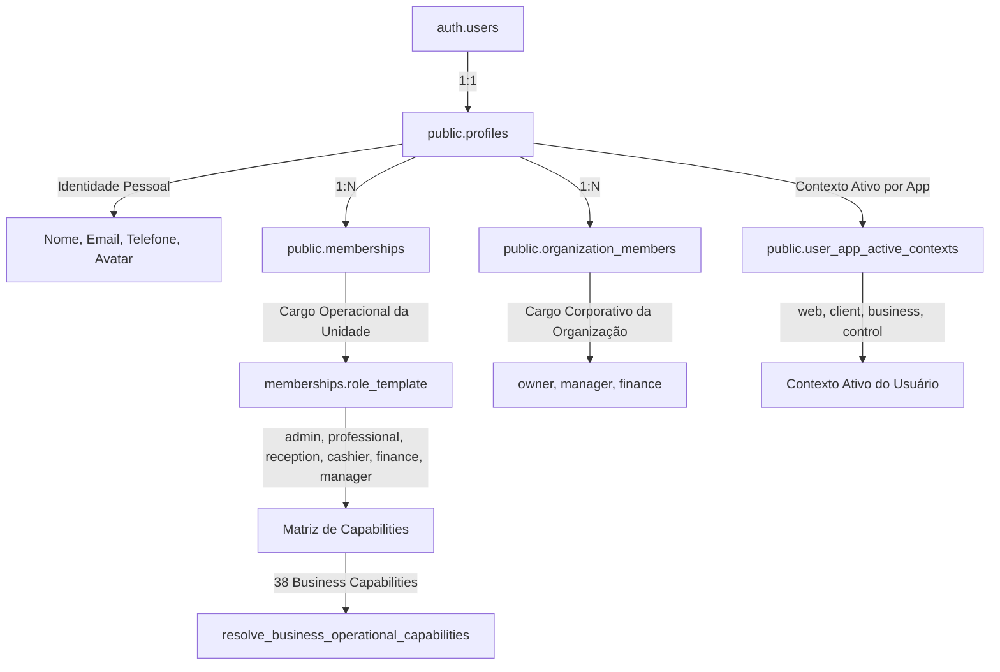

# Neutralização e Depreciação de `profiles.role`

## 1. Visão Geral e Contexto

No modelo original do CutSync (v1), a autorização de usuários e o escopo de atuação eram determinados diretamente pelo campo `profiles.role` (`client | professional | admin`) e `profiles.establishment_id`.

Com a evolução da plataforma para suporte a multiunidade, organizações, onboarding desacoplado e papéis operacionais granulares com matriz de capabilities (38 capacidades de negócio), o campo `profiles.role` foi transformado em **projeção estritamente legada de compatibilidade**.

Esta documentação formaliza a arquitetura, neutralização e hardening de `profiles.role` implementada nas etapas **PS1-E1A** e **PS1-E1A.1**.

---

## 2. Hierarquia e Fontes Canônicas de Verdade



### 2.1 Identidade Pessoal
* **Tabelas:** `auth.users`, `public.profiles`
* **Escopo:** Global por indivíduo.
* **Propósito:** Dados do titular (nome, e-mail verificado, telefone, preferências, avatar). Nunca define permissões de gestão de unidades.

### 2.2 Papel Operacional (Escopo da Unidade)
* **Tabela:** `public.memberships`
* **Coluna Canônica:** `role_template` (`admin | professional | reception | cashier | finance | manager`)
* **Propósito:** Define a função operacional exercida pelo profissional em determinado estabelecimento.

### 2.3 Autorização e Permissões Granulares
* **Catálogo:** `public.business_capability_catalog`
* **Função Resolver:** `public.resolve_business_operational_capabilities(establishment_id, profile_id)`
* **Propósito:** Resolve a lista exata de capacidades ativas (`create_team_walk_in`, `manage_services`, `take_payments`, `view_unit_reports`, etc.) considerando o cargo base e eventuais overrides.

### 2.4 Papel Corporativo (Escopo da Organização)
* **Tabela:** `public.organization_members`
* **Coluna Canônica:** `role` (`owner | manager | finance`)
* **Propósito:** Governança e visão consolidada de múltiplas unidades na organização.

### 2.5 Contexto Ativo da Aplicação
* **Tabela:** `public.user_app_active_contexts`
* **Funções RPC:** `get_my_authorized_contexts(app_id)` e `set_my_active_context(app_id, context_kind, ...)`
* **Propósito:** Persiste isoladamente por aplicação (`web`, `business`, `client`, `control`) qual estabelecimento ou organização está ativa no momento.

---

## 3. Mapeamento de Writers de `profiles.role` e `profiles.establishment_id`

| Função / Trigger | Última Definição Ativa | Escreve `profiles.role`? | Escreve `profiles.establishment_id`? | Escreve `profiles.commission_rate`? | Finalidade / Papel Arquitetural |
| :--- | :--- | :--- | :--- | :--- | :--- |
| `handle_new_user()` | `20260716050000` | **Sim** (`'client'`) | Sim (`NULL`) | Não | Inicialização padrão de conta pessoal |
| `accept_invitation()` | `20260801000000` | **NÃO** | **NÃO** | **NÃO** | Escreve exclusivamente em `memberships` |
| `accept_invitation_v2()` | `20260801000000` | **NÃO** | **NÃO** | **NÃO** | Escreve exclusivamente em `memberships` |
| `switch_active_establishment()` | `20260716050000` | **Sim** (`membership_role`) | **Sim** (`target_establishment_id`) | **Sim** | Legado v1; substituído por `set_my_active_context` |
| `remove_professional()` | `20260716052000` | **Sim** (`COALESCE(next.role, 'client')`) | **Sim** (`next.establishment_id`) | **Sim** | Fallback de desvinculação legada |
| `admin_update_professional()` | `20260717011000` | **NÃO** | **NÃO** | **Sim** | Atualização cadastral/comissão na unidade |
| `sync_membership_legacy_role_projection()` | `20260821000000` | **NÃO** (escreve em `memberships.role`) | **NÃO** | **NÃO** | Sincroniza `memberships.role_template` -> `memberships.role` |

---

## 4. Status das Colunas e Projeções Legadas

| Coluna | Status | Finalidade Atual | Substituta Canônica |
| :--- | :--- | :--- | :--- |
| `profiles.role` | **DEPRECATED** (Legado) | Projeção de compatibilidade somente leitura retornada por `get_my_profile()` | `memberships.role_template` + Capabilities |
| `profiles.establishment_id` | **DEPRECATED** (Legado) | Dica de último estabelecimento visitado (last-visited hint) | `user_app_active_contexts` |
| `memberships.role` | **DEPRECATED** (Legado) | Projeção binária `admin \| professional` sincronizada pelo trigger `sync_membership_legacy_role_projection` | `memberships.role_template` |

### 4.1 Projeção Dinâmica em `get_my_profile()`
A RPC `get_my_profile()` não lê a coluna física `profiles.role` como autoridade. Ela executa um `LEFT JOIN LATERAL` com `memberships` ativas e projeta dinamicamente:
```sql
COALESCE(active_membership.role, 'client')
```
Se a membership for revogada ou inexistente, a projeção retorna `'client'` imediatamente (fail-closed), independentemente de qualquer valor residual na coluna física `profiles.role`.

### 4.2 Proteção Contra Self-Escalation
O trigger `protect_profile_authorization_fields` bloqueia sumariamente qualquer tentativa de mutação direta em `profiles.role`, `profiles.establishment_id` ou `profiles.commission_rate` por usuários autenticados (`protected_profile_fields`).

---

## 5. Resolução de Superfícies Web e Separação de Billing

### 5.1 Significado de `WebOperationalSurface`
No frontend web, o tipo `WebOperationalSurface = 'admin' | 'professional' | 'client'` expressa o **layout operacional**, não um cargo individual:
* **Superfície `'admin'` (Business Management & Desk Surface)**: Destinada a operadores com capabilities de mesa ou gestão (recepção, gerência, caixa, administração).
* **Superfície `'professional'` (Personal Agenda Surface)**: Destinada à visualização individual da agenda do profissional (`view_own_agenda`).
* **Superfície `'client'` (Personal / Marketplace Surface)**: Superfície padrão para titulares sem contexto operacional ativo.

> [!IMPORTANT]
> **Superfície Web (`admin surface`) NÃO equivale a autoridade financeira (`billing authority`).**
> Um usuário no cargo de recepção opera na superfície `'admin'` para atendimento e encaixes de mesa, mas **NÃO** possui autorização de gerenciamento de assinatura ou portal financeiro.

### 5.2 Autorização Financeira e de Assinatura
A autorização para ações financeiras e gerenciamento de assinatura decorre exclusivamente do contrato de billing (`BusinessAccessContext` / `resolve_business_billing_context`):
* `access.billing_owner === true` OU
* `access.payer_role IN ('owner', 'finance', 'billing_owner')`

---

## 6. Política Fail-Closed de Exclusão de Conta Pessoal

A função `submit_client_account_deletion_request()` adota regra fail-closed:
1. **Titulares com Vínculos Ativos**: Se o usuário possuir qualquer `membership` com `status = 'active'`, qualquer vínculo corporativo em `organization_members` ativo, ou privilégios em `governance_users`, a solicitação é sumariamente rejeitada com a exceção de domínio:
   `active_business_relationship_requires_offboarding`
2. **Titulares sem Vínculos Ativos**: Clientes puros ou profissionais com vínculos já revogados têm a solicitação registrada com sucesso, independentemente de valores legados residuais em `profiles.role`.

---

## 7. Pré-requisitos para Remoção Física Definitiva (`DROP COLUMN`)

A remoção física definitiva da coluna `profiles.role` ocorrerá em etapas futuras de limpeza de schema quando os seguintes pré-requisitos forem atendidos:
1. Conclusão da migração de todos os clientes móveis antigos (garantia de versão mínima em produção).
2. Atualização das views analíticas e relatórios legados que referenciem a coluna direta.
3. Descontinuação completa das RPCs de transição v1 (`switch_active_establishment` e vinculações legadas em `profile_establishments`).
