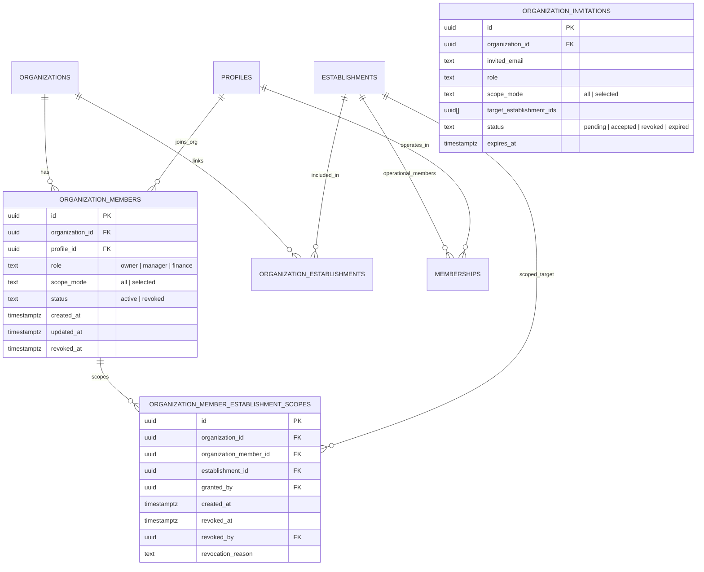

# Corporate Unit Scope Authority Architecture

## 1. Executive Summary

CutSync separates corporate governance from unit-level operational authority:

```
┌─────────────────────────────────────────────────────────────┐
│                    CORPORATE GOVERNANCE                     │
│  Person ──> organization_members (role: owner|manager|finance)│
│               ├─ scope_mode: all                            │
│               └─ scope_mode: selected                       │
│                    └─ organization_member_establishment_scopes│
└─────────────────────────────────────────────────────────────┘
                              ≠
┌─────────────────────────────────────────────────────────────┐
│               ESTABLISHMENT OPERATIONAL AUTHORITY           │
│  Person ──> memberships (role_template: admin|pro|cashier)  │
│               └─ business_capabilities (manage_team, etc.)  │
└─────────────────────────────────────────────────────────────┘
```

### Core Architectural Principles
1. **Organization scope ≠ establishment membership**: A corporate manager assigned visibility over Unit A has no automatic operational membership in Unit A.
2. **Organization role ≠ business capability**: Corporate roles grant aggregate visibility and group-level administrative operations. They **never** grant operational capabilities (`manage_services`, `manage_team`, `manage_clients`, `manage_team_orders`, etc.) within an establishment.
3. **Finance scope integrity**: The `finance` role requires `scope_mode = 'all'` to prevent indirect information leakage regarding consolidated billing and SaaS tier structures.

---

## 2. Relational Schema Model



---

## 3. Scope Authority Rules & Matrix

| Role | Allowed Scope Modes | Default Scope Mode | Capability Inheritance | Billing Visibility |
| :--- | :--- | :--- | :--- | :--- |
| **Owner** | `all` only | `all` | None | Full Consolidated |
| **Manager** | `all` or `selected` | `all` | None | None |
| **Finance** | `all` only | `all` | None | Full Consolidated |

### Authority Functions
- `public.has_organization_establishment_scope(target_organization_id uuid, target_establishment_id uuid, allowed_roles text[] DEFAULT NULL)`:
  Evaluates whether the caller has corporate scope over a specific unit in an active organization, checking active organization status, active establishment link, member role, and scope restrictions.

---

## 4. Aggregate Isolation in Reporting

When generating corporate reports via `public.get_organization_report(...)`:
1. The reporting query joins against `scoped_units`, which filters establishments strictly through `public.has_organization_establishment_scope(target_organization_id, establishment.id)`.
2. Unscoped units are omitted from all metrics (`production_realized`, `scheduled_value`, `appointment_count`, `completed_count`, `cancelled_count`, `occupied_minutes`, `available_minutes`).
3. Aggregates compute strictly over the actor's authorized units, ensuring mathematical and structural data isolation.

---

## 5. Lifecycle Hardening & Invariants

### 5.1 Convite V2 Persistence & Atomicity
- `organization_invitations` persists `scope_mode` and `target_establishment_ids` prior to acceptance.
- `accept_organization_invitation` executes in a single database transaction:
  - Upserts `organization_members` with `role` and `scope_mode`.
  - Cleans up any prior stale scopes from historical revoked memberships.
  - Inserts the selected unit scopes.
  - Never creates a transient state where a member with `selected` scope has `all` access.

### 5.2 Unit Removal & Re-Addition (No Stale Authority Resurrection)
- When an establishment is unlinked from an organization (`remove_organization_establishment`), all active scopes in `organization_member_establishment_scopes` for that unit are explicitly revoked with `revocation_reason = 'establishment_removed_from_organization'`.
- If the same establishment is later re-added (`add_organization_establishment`), members with `selected` scope **do not** regain access automatically until explicitly re-granted by the organization owner.

### 5.3 Role Transitions
- **Manager (Selected) $\rightarrow$ Finance**:
  - Automatically updates `scope_mode = 'all'`.
  - Soft-revokes all existing unit scopes with `revocation_reason = 'promoted_to_finance'`.
  - Emits audit log recording `previous_scope_mode = 'selected'`, `new_scope_mode = 'all'`, and `scope_expanded = true`.
- **Finance $\rightarrow$ Manager**:
  - Role becomes `manager`, retaining `scope_mode = 'all'`.
- **Owner Transfer (`transfer_organization_ownership`)**:
  - Target member becomes `owner` with `scope_mode = 'all'`.
  - Previous owner becomes `manager` with `scope_mode = 'all'`.
  - Prior selected scopes of new owner are soft-revoked with `revocation_reason = 'promoted_to_owner'`.

### 5.4 Revoke $\rightarrow$ Reinvite Scope Isolation
- When a revoked member is reinvited with a different set of units (e.g. previously `[A, B]`, reinvited with `[C]`), acceptance activates strictly `[C]`. Historical scopes `[A, B]` remain revoked.

### 5.5 Idempotency Contract
- **Invitation Token Idempotency**: Accepting a token for the second time fails closed with `invalid_or_expired_invitation`.
- **Scope RPC Idempotency**: `set_organization_member_unit_scope` accepts `target_request_id`.
  - Calling with identical parameters returns safely without duplicate audit rows.
  - Calling with a conflicting payload for an existing `target_request_id` raises `idempotency_key_reused`.

### 5.6 Audit Log Scope Leak Prevention
- RLS on `organization_audit_log` restricts managers with `selected` scope:
  - Event with `establishment_id`: visible only if that unit is in caller's active scope.
  - Event with metadata referencing `establishment_id`: visible only if referenced unit is in caller's active scope.
  - General organization events (no establishment references): visible to active managers.
  - Owner & Finance: full visibility.
